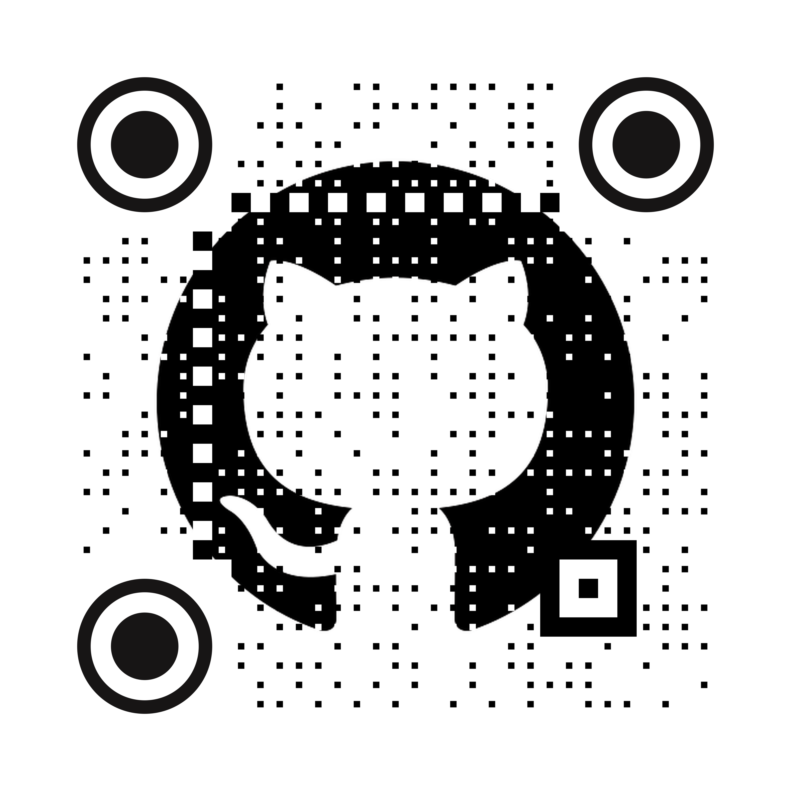
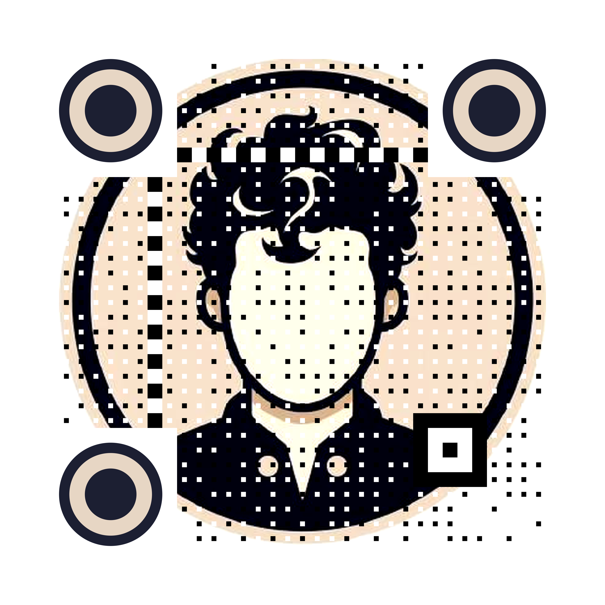

# Custom QR Code Generator

A powerful and flexible QR Code generator that allows you to create custom QR codes with images, custom finder markers, and dynamic color selection. It uses a ProcessPool to generate QR Codes in parallel.

## Examples
<p align="middle"> 



</p>

## Features

- Generate QR codes with custom sizes and resolutions
- Embed images into QR codes
- Use custom finder markers (e.g. circular instead of square)
- Dynamic color selection based on input images
- Batch processing support
- Configurable via INI file

## Requirements

- Python 3.7+
- Dependencies (install via `pipenv install`):
  - segno
  - Pillow
  - tqdm
  - pyvips

## Installation

1. Clone this repository
2. Ensure you have Python 3.7+ and pipenv installed
   - To install pipenv:
      ```
      pip install pipenv --user
      ```

3. Install pyvips system dependencies:
   - On Ubuntu/Debian:
     ```
     sudo apt-get install libvips-dev
     ```
   - On macOS (using Homebrew):
     ```
     brew install vips
     ```
   - On Windows, follow the instructions on the [libvips website](https://github.com/libvips/libvips/wiki/Build-for-Windows)

4. Install project dependencies:
  ```
  pipenv install
  ```

## Usage

1. Configure the settings in `config.ini`:
   - Set the desired width, height, and DPI for the QR codes
   - Specify the default URL (if not using batch processing)
   - Set the input and output paths
   - Choose whether to use a custom finder marker

2. Run the main script:

```bash
python src/main.py
```

3. Follow the prompts to adjust settings or use defaults.

4. For batch processing, create a CSV file with relative image paths and URLs, then specify the batch file path in `config.ini`.

## Customization

- Custom Finder Markers: Place your SVG marker in the `markers/` directory and update the `CustomMarkerSVG` path in `config.ini`.
- Color Schemes: Modify the `colour_finder.py` file to adjust color selection algorithms.

## License

This project is licensed under the BSD 3-Clause License.

## Author

Mohammed Alkhateeb (@MoAlkhateeb)

## Acknowledgements

- This project uses a modified version of the color-finder algorithm from [pieroxy/color-finder](https://github.com/pieroxy/color-finder) (WTFPL, Version 2).
